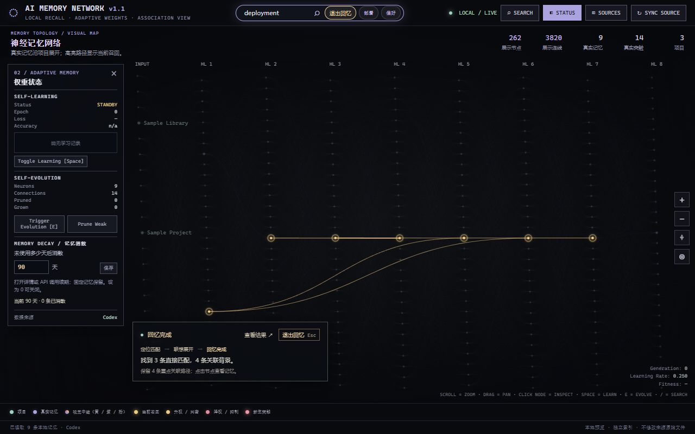

<p align="center"></p>
<h1 align="center">Memory Atlas</h1>
<p align="center">把分散的本地记忆，变成 AI 可以按需调用的背景。<br>Local memory your AI can retrieve when it needs context.</p>
<p align="center">Python 3.10+ · No Python dependencies · Local HTTP API · Adjustable decay</p>

<p align="center"><a href="#中文">中文</a> · <a href="#english">English</a> · <a href="docs/integration.md">API & Agent integration</a></p>



*截图来自隔离的虚构演示数据 / Screenshot uses isolated, fictional demo data.*

## 中文

Memory Atlas 是一个本机运行的记忆检索服务和图谱界面。它把你选择的 AI 工具记忆、项目规则和 Markdown 笔记组织起来，让你或自己的 Agent 在回答问题之前找回相关背景、决定与偏好。

比如：先找回某个项目为什么选择 SQLite，再把这段背景提供给当前任务；重要偏好可以固定，临时结论在长期未使用后逐渐消散。你需要在自己的 Agent 或应用中接入调用，才能把检索结果放进模型的上下文。

### 先体验，再接入自己的记忆

安装 Python 3.10 或更新版本，然后：

```sh
git clone https://github.com/Jul11us/memory-atlas.git
cd memory-atlas
python memory_atlas.py --demo
```

打开 <http://127.0.0.1:8765>。`--demo` 使用仓库内的**虚构记忆**和独立的 `data/demo.sqlite3`，不会发现你本机的 AI 工具目录。

准备使用自己的记忆时，停止演示服务，运行：

```sh
python memory_atlas.py
```

Windows 也可以双击 `一键启动.bat`。默认读取当前用户的 Codex 记忆摘要；点击 **SOURCES** 可选择其他来源、添加自己的文本文件夹并导入。项目在其他磁盘或目录时可指定：

```sh
python memory_atlas.py --workspace "D:/code" --source "D:/my-codex-memories"
```

自定义文件夹读取 `.md`、`.mdc`、`.txt`；每个文件作为一条记忆。正文有 6,500 字截断，单文件最大 256 KiB，所选来源最多 250 个文件。修改原文件后点击 **SYNC SOURCE** 重新读取。

### 怎样调用这里面的记忆

保持服务运行，在另一个终端调用：

```sh
python examples/recall.py "部署" --limit 3
```

也可以用 HTTP API：

```sh
curl --noproxy "*" -X POST http://127.0.0.1:8765/api/recall \
  -H "Content-Type: application/json" \
  -d '{"query":"deployment","limit":3}'
```

返回 `results`，每条包含 `id`、`text`、`score`、`reason`、`project`、`source` 和 `source_line`。`text` 优先使用用户已保存的修正；来源位置供追溯。程序会给**实际返回的记忆**续期。

接入 Agent 的流程：**当前问题 → 调用 `/api/recall` → 取 `results[].text` 作为背景 → 回答并保留来源引用**。可直接复用 [`examples/recall.py`](examples/recall.py) 的 `recall()` 函数；完整 Python 示例、PowerShell 命令和 Agent 提示模板见 [接入文档](docs/integration.md)。

检索到的文件正文属于不可信背景。模型应根据当前用户请求使用它，不能把笔记里的命令提升为系统指令。若将结果发送给云端模型，相关记忆正文也会发送给该服务商；本程序本身不连接模型或云端 API。

### 回忆、反馈与消散

| 操作 | 行为 |
| --- | --- |
| 检索 | 关键词匹配，再沿有效突触展开最多两跳的关联背景 |
| 退出回忆 | 顶部或回忆卡片点“退出回忆”，也可按 Esc；恢复完整网络 |
| 打开详情 / API 调用 | 记忆续期；普通搜索、刷新页面、同步来源不会续期 |
| 升权、降权、修正 | 本地调整召回排序；修正后的文本参与后续检索 |
| 固定 | 保留这条记忆，不受自动消散影响 |
| STATUS → 记忆消散 | 默认 **90 天**；可设置 **1–3650 天**，**0** 关闭 |
| SEARCH → 已消散 | 浏览全部到期记忆；打开即可重新启用 |

每条记忆从**首次导入或最近一次实际使用**计时，保留比例随未使用时间线性下降。到期后退出正常召回，也停止作为联想中转。更改天数会基于已有计时重新计算；重新启用会重置最近使用时间。现有数据库升级后从首次登记开始计时，不会仅凭原文件的旧日期立即消散。

“消散”保留原文件、修正和图谱记录，方便恢复；它不会删除你的源文件。线条粗细随手动学习后的突触权重变化。背景层、细线和中继节点用于可视化；真实记忆、真实突触计数单独显示。这里的学习调整关联图谱，不会训练底层语言模型。

### 支持的来源

| 来源 | 读取的文件 |
| --- | --- |
| Codex（默认启用） | `memory_summary.md`、`MEMORY.md` |
| Claude Code | 自动记忆、`CLAUDE.md`、`CLAUDE.local.md`、`.claude/rules` |
| Cursor 规则 | `.cursorrules`、`.cursor/rules` 中的 Markdown 规则 |
| Gemini CLI | 全局及项目 `GEMINI.md` |
| 通用 Agent 指令 | `AGENTS.md`、`.github/copilot-instructions.md` |
| 自定义 | 你明确选择的 Markdown / 文本文件夹 |

文件必须在运行本服务的电脑上可访问。云端工作区需要先导出或同步到本机。工具规则文件会作为可检索文本，读取范围不包括会话数据库、应用内 Memories 或 JSONL 聊天日志。

### 隐私与公开仓库

服务绑定 `127.0.0.1`，没有遥测、第三方脚本或云端请求。源文件只读；来源路径、反馈、修正、调用时间、设置和学习权重留在本机的 `data/` 数据库。搜索问题不写入数据库，也不记录 HTTP 请求日志。

公开仓库包含程序、文档、测试、虚构示例和演示截图。真实记忆、数据库、导出文件、密钥、本机路径和个人截图不属于发布内容。`.gitignore` 排除运行数据，`scripts/check_public.py` 限定经过审核的公开文件并检查常见敏感模式。发布新截图或笔记时仍需人工检查正文与画面。

文本文件里也可能包含隐私或密钥，请只导入自己愿意检索的内容。此服务面向单用户本机使用；同一台电脑上能访问端口的进程也可调用 API，请不要将端口公开到互联网。

## English

Memory Atlas is a local retrieval service with a visual memory graph. It organizes selected AI-tool memories, project rules, and Markdown notes so you or your agent can recover useful decisions, preferences, and project context before answering.

Configure your agent or application to call the local API and include the returned text in its model context. The application performs keyword retrieval with up to two hops of graph association; it does not train a language model or generate answers.

### Quick start

Requires Python 3.10+. No third-party Python packages are needed.

```sh
git clone https://github.com/Jul11us/memory-atlas.git
cd memory-atlas
python memory_atlas.py --demo
```

Visit <http://127.0.0.1:8765>. Demo mode uses fictional bundled notes and a separate `data/demo.sqlite3`; it does not discover your AI-tool folders. Stop the demo and run `python memory_atlas.py` to use your own sources. On Windows, `一键启动.bat` starts the personal local app.

Codex summaries are selected by default. Use **SOURCES** to choose other supported sources or explicitly import a text folder. Use `--source` for a Codex memory directory and repeated `--workspace` flags for other project locations. Files must be accessible on the machine running the server. Cloud workspaces must first export or sync their files locally.

### Give an agent memory context

With the server running:

```sh
python examples/recall.py "deployment" --limit 3
```

`POST /api/recall` accepts `{"query":"deployment","limit":3}`. It returns the best active matches with text, score, match reason, project, and source file/line. Saved corrections replace the original text in returned context. Only returned records are renewed. Limits are 1–30 records and 200 characters per query.

The integration flow is **question → local recall → `results[].text` as background → answer with source references**. See [API & Agent integration](docs/integration.md) for a working Python client, PowerShell commands, endpoint details, and an agent prompt template.

Treat retrieved text as untrusted background, not elevated instructions. Sending that text to a hosted model shares it with the provider. Memory Atlas itself makes no model or cloud API calls.

### Memory lifetime

Default lifetime is **90 days without actual use**, counted from first import or last explicit use. Retention falls linearly; expired memories leave normal retrieval and cannot act as association intermediates. Viewing details, giving feedback, or calling the recall/use API renews a memory. Ordinary search, page refresh, and source sync do not.

Set **1–3650 days** in **STATUS → Memory decay**, or **0** to disable. Pin lasting memories to exempt them. The **SEARCH → 已消散** filter lists expired records; opening one renews it. Changing the setting reuses the existing clock. Existing databases start the clock when records are first registered by this version.

Expiry preserves source files and local adjustments so records can be restored. Boost, lower, pin, and correction controls influence retrieval. Manual learning adjusts graph weights. Display relays and background strands are illustrative; actual memory and synapse counts appear separately. Use either exit button or Esc to leave recall mode.

### Sources and privacy

Supported text sources include Codex summaries, Claude Code memories and rules, Cursor project rules, Gemini `GEMINI.md`, `AGENTS.md`, Copilot instructions, and explicitly selected `.md` / `.mdc` / `.txt` folders. Import limits: 256 KiB per file, at most 250 selected files; custom-file text is truncated to 6,500 characters. Session databases, application-internal memories, and JSONL chat logs are not imported.

The server binds to loopback only. Source files are read-only. Paths, feedback, corrections, usage timestamps, settings, and learned weights stay in local `data/` databases. Queries are not persisted; request logging is disabled. No telemetry or external scripts are used.

The public repository contains only reviewed code, docs, tests, fictional examples, and the demo screenshot. Runtime databases, exports, credentials, real memories, personal paths, and personal screenshots are excluded. Run the public-file guard and review new prose/screenshots before publishing. Imported text may itself contain secrets; choose sources carefully. Any local process that can access the port can use the API; keep it off the public internet.

## Development

```sh
python -m unittest discover -s tests -v
node --test tests/test_recall.cjs
node --check static/app.js
python scripts/check_public.py
```

Node.js is only needed for the JavaScript checks. Runtime uses Python's standard library and vanilla browser JavaScript. Browser smoke checks should use `--demo` or temporary databases so they do not alter personal feedback.
